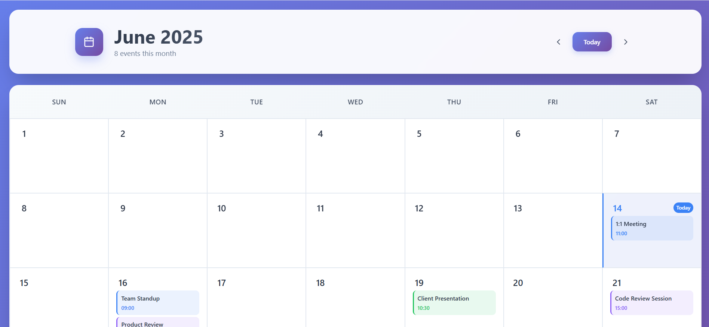

# 📅 Advanced Calendar Application

  
*Clean, intuitive calendar interface with event management*

## Overview

The Advanced Calendar Application is a modern, user-friendly calendar solution inspired by Google Calendar. It features a sleek UI with gradient backgrounds, glass-morphism cards, and smooth animations. The application allows users to navigate between months, view events, and manage their schedule with an intuitive interface.

## 🚀 Live Demo

[View Live Demo](https://calendar-sand-rho.vercel.app/)  

## ✨ Features

### Core Functionality
- **Month Navigation**: Easily switch between months with intuitive controls
- **Event Display**: Color-coded events with time details
- **Today Highlighting**: Current date is clearly marked
- **Event Legend**: Quick reference for event types
- **Responsive Design**: Works seamlessly on all device sizes

### Advanced UI Elements
- **Glass-morphism Cards**: Semi-transparent UI elements with blur effects
- **Smooth Animations**: Fade-in and slide transitions for interactions
- **Gradient Backgrounds**: Visually appealing color schemes
- **Consistent Typography**: Clean, readable text throughout

## 🛠️ Installation

```bash
# Clone the repository
git clone https://github.com/Rohith1034/Calendar-Task.git

# Navigate to project directory
cd advanced-calendar-app

# Install dependencies
npm install

# Start the development server
npm start
